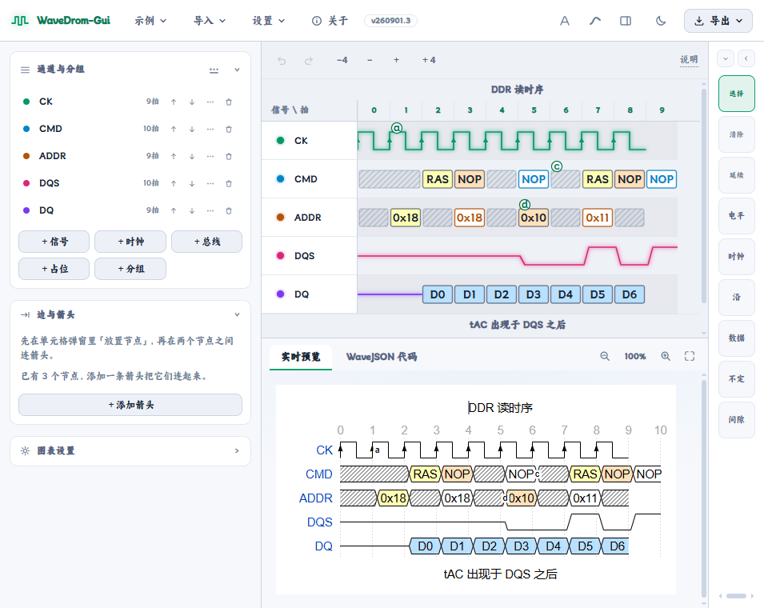

# WaveDrom Web 编辑器（index.html）

**简体中文** | [English](./EDITOR.en.md)

单文件 HTML 应用（约 500 KB，零构建、离线可用）：用鼠标点击/拖拽编辑 WaveDrom 时序图，右侧官方引擎实时渲染，左侧同步生成 WaveJSON 代码，兼容大部分 WaveDrom 常用语法。

## 使用

直接用浏览器打开 `index.html` 即可（file:// 协议可用，无需服务器）。也可直接使用 [demo站点](https://wave.rtlyes.cn/) , demo站点不保证可用(因为用的是免费服务)

## 界面语言

顶栏「设置」左侧有**地球图标**的语言切换按钮：默认**跟随系统语言**（中文系统→中文，否则英文），也可手动选择「跟随系统 / 简体中文 / English」，偏好持久化。双语覆盖顶栏菜单、侧栏面板、编辑工具栏、设置菜单全部选项、各弹窗（图表设置 / 边与箭头 / 状态面板 / 粘贴 / 快捷键 / 关于）、笔刷名称、空状态与主要操作提示；偏好（自动保存的文档内容）与语言无关。

## 编辑

- **增减拍** 编辑区上方的工具栏的`-4 - + +4`就分别用于减少4拍，减少1拍，加1拍，加4拍！
- **点选**：选择工具点击任意单元格，弹出状态面板（24 种波形状态 + 延续 + 数据标签 + 节点标记）；**当前状态自动高亮**，标题同步显示（如"当前：数据·黄 (3)"）；标题栏右侧的折叠按钮可收起/展开状态字符网格（折叠态记忆，重开面板保持）
- **滚轮切换**：在单元格上**滚动鼠标滚轮**即可切换状态并立即渲染——**非自动模式下无需点选**，直接悬停任意格滚动即可（若已选中某格且面板打开，则只在该选中格上生效并跟随面板）；**自动模式下**在当前锁定格上滚动就地变换、不右移（面板开着则跟随刷新）；**变换规则按字符本身归类**（空格 / 延续格 / `x` 会向前追溯到本列最近的真实字符当基准，一路只有 `x`/`.`/空则按 `x`）：**时钟**上滚 = 大小写互切（`p↔P`、`n↔N`，相位不变）、下滚 = 正负相切换（`p↔n`、`P↔N`）；**总线**上滚 = 数值 +1（`=` 起手进 `2`，`2–9` 之间环形回绕）、下滚 = 一律变 `x`；**信号**按成对关系切换（上滚取高/前者：`0→1`、`l→h`、`L→H`、`d→u`；下滚取低/后者），到端点即停不回绕；`x` 上滚进 `2`、下滚不变，`z` 上滚进 `1`、下滚进 `0`；识别不了的字符原样返回；连续滚动合并为一步撤销
- **笔刷**：选笔刷后点击或按住拖过单元格涂抹；「数据」及数字笔刷（2–9，官方逐框配色）拖动自动拉出宽框；「.」笔刷延续上一拍状态（时钟后会继续走时钟）；**自动去毛刺**（默认关，可在 设置 → 笔刷 或预览区底栏开启）：写入电平字符（高 `1/H/h`、低 `0/L/l`）后就地把所在连续同电平段归一成「段首 + 延续符」——段首（真实跳变处，沿/箭头落点）保留原字符，段内其余显式字符换成 `.`（同电平 `h/H/l/L` 的冗余竖沿随之消除，`1/0` 收敛为点）；扫描遇异电平、`u/d`、时钟、`x/z`、数据、`|`（不跨间隙）或空格即停；仅编辑写入生效（导入/粘贴不动），撤销一步整体回退；开启时会提示「会实时自动使用延续符尽可能合并相同电平信号！」；笔刷栏五种形态互相折叠：下横条（全量平铺）⇄ 横向弹窗条（紧凑纯文本，分组悬停/点击弹层、离开或选择后自动隐藏）⇄ 右下角按钮（悬停/点击展示面板，离开或选择后自动隐藏）⇄ 右纵条（右侧窄分栏、分组纵排，弹层同横向弹窗条）⇄ 右侧完整面板（列数 1–5 自适应、先纵后横）；设置中「笔刷栏默认样式」三选：下横条 / 右纵条 / 右下角；支持键盘字符直切（`0` `1` `p` `=` `|` 等，`Esc` 回选择）。分组弹层**最左**有「钉」按钮：钉住后选择笔刷弹层保持（再次点击分组按钮收起），偏好持久化。手机（≤800px）默认横向弹窗条且笔刷显示双行；**手机分组精简为 4 组**——电平（并入沿）/ 时钟 / 总线（原「数据」，额外含 `x`）/ 其他（不定+间隙），且**每组末尾都带「.」延续笔刷**，工具栏因此不再单列独立的延续笔刷（桌面仍为 6 组 + 独立延续）
- **右键**：清除单元格；按住状态格**向右拖动** = 延续（`1....` 语义）；按住一格拖动时，**指针的高度决定做什么**（分区按画面上的电平高度，与绘制坐标同一套常量：高电平线 `y=13`、中线 `y=24`、低电平线 `y=35`）——**在信号中线以上拖 = 上变换、中线以下拖 = 下变换**（与滚轮同一套规则：电平 `0↔1`、时钟大小写与相位、总线 +1 或变 `x`…），**中线上下各 8px 的中间带（合计 16px 宽）拖 = 延续**（`1....` 那套）。因为分区就是画出来的高度，所以「把指针放到信号线上面/下面」在画面上对得上；把指针拖到行外再向右扫，也会逐列变换（原本的连续变换玩法保留）。要调整中间带宽度改 `DRAG_LEVEL_DEAD` 一个常量即可
- **拍级插入 / 删除**：新插入的一拍内容默认是**延续符 `.`**（电平保持、时钟照常走拍、数据框顺延加宽且标签留在原位），所以观感就是「波形之间撑开一拍」，不改变原有形状。**在开头插入时**（第 0 拍之前，或前面全是空/延续格）延续符无处可延续、渲染出来是空白，此时新拍改为**采用后面那一拍的状态**（电平保持同电平、时钟继续走一拍、`x`/`z`/沿 同形复制）；**数据字符**（`=` 与数字）例外，此时用 **`x`** 占位——渲染成不定框看得见，又不会在前面另起数据框把 `data` 数组的标签整体挤后一位。四处入口按范围分工——**整列（所有通道）**：鼠标移到时间刻度表头里**列与列之间的缝隙**时，该列上方会**弹出一条胶囊按钮**（左边标出拍号，右边是加粗的「＋ / −」两个大按钮，点 ＋ 在前插入一拍、点 − 删除该拍；胶囊能连续点，插完自动重新定位到同一缝隙）；缝隙本身是一条隐形命中条，指针落在上面才显出一条 1px 竖线提示；胶囊与表头**紧贴重叠 2px**（移过去时不会经过空隙），并且移开后有约 **0.26 秒宽限期**才收起——从缝隙挪到胶囊、或手抖一下再回来都不会扑空，移进波形区同样在这个宽限期后收起。**触屏**（没有 hover）：**点表头某一列弹出同一条胶囊，再点同一条收起**——胶囊在手机上和桌面一样好用；锚点滚出可视区或窗口缩放时自动收起（桌面滚轮滚动会换掉指针下的元素、约 0.26 秒后收起；触屏平移时跟着重新定位）。**当前通道**：单元格状态面板底部的「**＋ 前插一拍 / − 删除本拍**」——胶囊按钮，与应用里选中态同一套淡彩语言（12% 淡绿/淡红底 + 彩色描边与符号，绿=插入、红=删除），旁边的「清除本格」同为胶囊但保持中性色、悬停才提示危险色；手机面板同位置也有一行「＋ 前插一拍 / − 删除本拍」。删除某拍时，该拍上的节点标记一并清除、引用它的连线同步清理并在提示里报条数。所有操作**一步 `Ctrl+Z` 整体回退**。三点说明：① 删除/插入的是**拍位**，与「清除本格」（置空但保留拍位）语义不同；② `period>1` 的通道里「一拍」是该通道自己的整拍（占 `period` 列），所以它右移的列数多于 `period=1` 的通道——「每条通道各加一拍」的语义必然如此；③ `hbounds` 裁剪窗口不跟随位移（与既有的末尾增减拍一致），需要时在「图表」弹窗里手动调；表头的显式刻度数组（每列一个标签的三元及以上数组）会跟着挪位，数字 / `"起点 步长"` 形式自动跟随列号
- **节点与箭头**：单元格弹窗「放置节点」自动分配 a–Z 字母；左侧「通道与分组」面板点「边与箭头」弹窗连线，覆盖全部 wavedrom 箭头写法；连线与标注实时显示在编辑区网格上；顶部「设置」菜单可选节点圆标九宫格位置（默认左中）与显示比例（50%–150%）；**同一对节点之间的多条连线自动错开**——直线类沿连线法线平行扇开、曲线类拱高逐条递增，标签沿路径错位，互不重叠
- **分组**：支持嵌套子分组；通道可移入/移出分组；组行为纤细分隔带，编辑区分组行的 ▸ 可折叠/展开整组信号（导出跟随可见内容）
- **通道属性**：⚙ 设置 period（周期）与 phase（相位），如 DDR 示例的 CK×2、命令相位 0.5
- **自动模式**：顶部「自动」按钮或鼠标中键点单元格启动，锁定一格连续给状态；键盘笔刷字符 / 点笔刷 / 面板内点状态字符都会给当前格上色并**按当前方向前进**。**按钮三态循环**——关闭（「自动」）→ 右移（「自动 →」，逐格右移，本行到头跳下一可见信号行首格）→ 下移（「自动 ↓」，逐格下移，换下一可见信号行、拍不变）→ 关闭；手机端按钮文字相应为「自动」→「右移」→「下移」；退出后方向重置，下次开启默认右移。方向键可移动选中格。**状态面板开着时，选中格无论因何变动，面板都会跟随到新格**（键盘笔刷、点笔刷、面板内点字符、方向键、中键均适用）；`Enter` 开关面板，`Esc` 先关面板、再按才退出模式；走到尽头（右移到最后一行末尾 / 下移到最后一行）会停留在当前格、不自动退出
- **标签保持**：设置中默认开启「标签保持」。开启后，带数据标签的单元格在 `= 2–9` 数据字符间切换颜色时保留标签；切换到 `x`/`z` 时标签暂时隐藏但在当前选中期间暂存，切回数据字符恢复；直接使用 `= 2–9` 数据笔刷修改带标签单元格时也保留标签。单元格脱离选中后暂存失效。关闭后恢复换字符即清除标签的旧行为
- **触屏与窄屏**：视口 **≤800px 宽或 <600px 高**时自动切手机（简约）布局——窗口压矮时紧凑布局比硬塞桌面版实用（工具栏收紧、左栏收成 ◫ 抽屉、预览/代码收成入口按钮）；也可在**设置 →「视图模式」**里手动选择：**自动**（按视口判断桌面/手机）、**简约模式**（不论视口固定使用手机版）或**桌面模式**（不论视口固定使用桌面版，偏好持久化）；**顶栏精简**——只保留品牌名（显示 Wave，版本号淡胶囊内联同一行）与靠右的**设置 / 导入 / 导出**（纯文字紧凑、无下拉箭头）；**编辑工具栏最左有 ◫ 一颗钮**：点按**显示/隐藏「通道与分组」面板**——显示时面板为编辑区左栏（一列小按钮：＋信号/时钟/总线/占位/分组 + 「节点」「图表」两颗弹窗按钮），笔刷工具栏**横跨面板与编辑区共同的全宽底部**、编辑网格居右；隐藏时编辑区全宽（偏好持久化）；**实时预览与 WaveJSON 代码默认折叠为两个按钮**（固定于页面底部），点击以浮层弹出（预览/代码可切换，✕ 或再次点按钮收起）；**左栏底部常驻这两个入口**（桌面与手机都有；简写 `W 预览` / `W 代码`，无图标，当前显示的那个高亮）：**桌面点它只管这个窗口自己**：正在显示的点它 = **关掉它**（另一个窗口接着显示；两个都关掉时整栏自然收起），没显示的点它 = **切过去**（之前被关掉过则先打开）。高亮 = 当前显示的是它（桌面与手机一致）；**（桌面）点一个入口永远不会改动另一个窗口的开关**——那一份状态与设置 → 视图 → 窗口显示里的开关完全相同；**手机**点它是开 / 收浮层（入口常显可点，点一下才展开；此时底部那排让位、浮层避开左栏），不改动桌面那两个开关；分组笔刷弹层笔刷多时自动换行、宽度钳在视口内（不跑出屏幕）；触屏（粗指针设备）支持**单指涂画/延续/擦除**（「清除」笔刷在触屏上可直接激活为擦除工具，桌面仍以右键清除为主）、双指平移网格、从把手拖拽排序；信号\拍 角格有开关按钮，控制名称列的拖拽/更多/删除悬浮按钮显隐（默认隐藏，偏好持久化）；状态面板精简为三行——第 1 行标题（当前状态），第 2 行「数据格标签输入 · 放置/移除节点」，第 3 行「＋ 前插一拍 / − 删除本拍」（胶囊按钮，高度 24px，与第 2 行间距 8px）；状态字符网格、填充色、清除按钮均去掉（改状态用底部笔刷栏或滚轮）。改名输入时悬浮操作条自动隐藏。桌面鼠标行为不受影响

## 结构与设置（左侧栏 + 弹窗）

- **通道与分组面板**：桌面常驻为编辑区左栏（一列按钮宽），手机为 ◫ 开关显示的左栏面板。内容为单列的添加按钮（＋信号/＋时钟/＋总线/＋占位/＋分组）、两颗弹窗按钮与「清空」；「清空」= 清掉全部信号恢复空白文档（`Ctrl+Z` 可撤销）；新增通道**预填长度跟随现有波形**——文档里最宽的一条有多少拍就补多少（按列算，`period`/`phase` 的通道按实际占列），文档还没有波形时用默认 8 拍；基调字符时钟 `p`、信号 `0`、总线 `x`，首拍落基调、其余为延续符 `.`。通道管理全部在**编辑网格行头**完成：行内直接改名，悬停名称列浮出 ⋮⋮ 拖拽把手与 ⋯/🗑（⋯ 菜单：复制通道 / 移入上方最近的分组 / 移出所在分组 / 通道属性；删除是旁边独立的 🗑，占位行只有 🗑）。**拖拽排序**：落到目标行上/下沿 = 移到其前/后，落到分组行中部 = 移入该组末尾（组行高亮提示）；拖分组时整体移动且不会落进它自己；拖拽中 `Esc` 取消，落位计入撤销
- **信号列宽**：默认自适应——列宽跟随最长名称（canvas 按实际字体精确测量，中英文都准），上限 480px，超长名省略号截断、悬停输入框可看全名；名称列与波形区之间有**可拖拽分割条**，拖动手动调宽（记忆偏好），双击恢复自适应；悬停任意名称输入框显示完整名字
- **节点**（面板内按钮，弹窗）：放置节点后在弹窗里连线——节点间连线列表（样式 + 标注），内容高于视口时弹窗内部滚动
- **图表**（面板内按钮，弹窗）：head/foot 文字与 tick/tock/every 刻度（支持数字、`"起点 步长"` 字符串、自定义标签数组）、**自动缩放**与 hscale 水平缩放、default/narrow 皮肤、hbounds 横向裁剪（预览与编辑区同步生效）；内容高于视口时弹窗内部滚动
- **自动缩放与宽标签**：编辑区的**数据框标签过长时不再压缩字距**，而是按字符省略——优先「开头…末尾字符」（如 `VERYLONGNAME` → `VE…E`），空间还不够就只留开头，始终在单元格宽度内正常显示尽可能多的字符。**省略后的标签把鼠标悬停上去即可弹出完整内容**（气泡跟随该数据框的每一格，移开即收起；标签完整显示时不出气泡）。想让标签完整显示可以手动加大 hscale，或打开**自动缩放**（默认关，两处开关：设置 → 笔刷 → 自动缩放、左栏「图表」→ 波形 → 自动缩放，共用同一份偏好）：打开后每次文档变化都按**最宽的总线标签**自动挑能容纳它的最小整数档 hscale（1–8，写在 WaveJSON 的 `config.hscale` 里，预览与导出同步生效），手动滑块置灰并显示自动算出的档位；**倍数上限**可设（设置 → 笔刷 → 自动缩放上限、左栏「图表」→ 波形 → 自动缩放上限，两处同一份偏好，档位 2×–8×，**默认 4×**）：需要超过上限时停在上限，超出的标签转为省略显示 + 悬停看全文，避免一个超长标签把整张图拉得极宽；上限调上或调下都会立即重算；关闭后保留最后算出的档位、滑块回到手动。**宽标签首次提示**：导入的图表里已有放不下的标签，或首次给当前图表输入宽标签时，弹一次询问要不要打开自动缩放，并附「永久 / 一天 / 一周」不再提示的选项（选择持久化，抑制期过后再遇到同样情况会重新询问，「稍后再说」则只在本次会话内不再打扰）；不论是否打开都会说明之后自己去哪里设置
- **列数步进**：−4/−/＋/＋4 调整网格拍数，下限自动跟随波形内容

## 视图与外观

- **主题**：深色（逻辑分析仪）⇄ 浅色（工程图纸），偏好持久化；**官方渲染**导出的 SVG/PNG 恒为浅色原始配色，**编辑区矢量重建**导出跟随当前主题
- **波形背景**：设置 → 外观「波形背景」N 选 1——默认（主题底色）/ 纯白 / 米纸 / 雾蓝 / 苔绿，深浅主题各自映射到对应色调（深色下为纯黑/暖炭/深蓝/墨绿），偏好持久化；编辑区截图导出的底色与名称列底色跟随该设置
- **信号名底色**：设置 → 外观「信号名底色」可选「独立底色」（名称列用面板色与波形区分）或「与波形同色」（**默认**，名称列与波形区同底色，右缘分割线保留），悬停/选中反馈不变，偏好持久化
- **斑马纹**：设置 → 外观「斑马纹」可显示/隐藏波形区奇数行的淡底条纹（默认显示，便于横向追踪行；分组行的淡绿为分组功能色，不随此开关）；「信号名同色」开启且斑马纹显示时，名称列奇数行也带同款条纹、与波形行逐行对齐，偏好持久化；编辑区截图导出跟随上述设置
- **视图**：**设置 →「视图」**里可选择预览在右侧 ⇄ 预览在下方，并独立显示/隐藏实时预览窗口与 WaveJSON 代码窗口；两处**可拖拽分割条**自定义布局（预览区大小、信号列宽，双击重置），偏好持久化。**预览区底栏**有两颗按钮：**「一键去毛刺」**手动全图扫一遍——有毛刺提示去掉几个、没有毛刺直接提示没有毛刺（不受自动开关影响，同电平 `1/0` 的纯规范合并也会一并计数并附注），**「自动去毛刺」**开关显示当前开/关，与 设置 → 笔刷 里的同名项**共用同一份偏好**（任一处改动即时同步，开启时弹出说明提示）。**窗口高度不足 600px（或宽度 ≤800px）时**，自动模式整体切到**简约（手机）布局**：工具栏收紧、左栏收成 ◫ 抽屉、预览/代码收成入口按钮（这也是矮窗口下腾出编辑空间的主要手段）。拉高 / 变宽即回到桌面布局，全程不改偏好
- **代码显示**：WaveJSON 代码页舒缓（短对象单行、128 列预算）/ 紧凑（通道对象单行、骨架逐行）两种模式，偏好持久化；下载/复制 JSON、kroki 代码块与 **VS Code 插件的代码块写回**均跟随当前显示模式（紧凑模式下写回不再被强制展开成 2 空格缩进）
- **字体**：界面与数据/代码字体独立选择——霞鹜文楷等宽（默认，在线分片加载）/ 霞鹜文楷 / IBM Plex Sans + JetBrains Mono / 系统字体（system-ui，零网络依赖）
- **轨迹样式**：纤细 / 荧光辉光两种描边风格

## 导入导出

- **导入**：打开文件（JSON，或内嵌 WaveJSON 的 SVG / PNG）、把文件直接拖进网页窗口、粘贴 WaveJSON、URL `#` 参数（兼容官方编辑器链接与压缩分享链接；**导入后地址栏不再保留波形代码**，编辑过程也不写入地址栏）；支持宽松 WaveJSON——`//` 注释、免引号键、单引号、尾逗号（解析行为与官方编辑器一致）
- **导出**：官方渲染 SVG / PNG(2×)；编辑区截图 SVG / PNG(2×)（矢量重建，不含工具栏与右侧空白列、下方空白区，配色随当前主题，名称列字号与位置取自屏幕真实布局、与所见一致）；JSON / 复制 kroki 代码块 / 复制分享链接（官方 WaveJSON 格式，与官方编辑器互通）/ 复制分享链接（压缩，lz-string 编码，长度约省六成，本应用可打开）；导出的 SVG/PNG 内嵌 WaveJSON 元数据（SVG `<metadata>` / PNG `iTXt` 块，不影响显示）与**导出来源标记**（`data-export` 属性 / `WaveDromGui` iTXt 关键字，区分官方渲染还是编辑区矢量重建），导入时自动回读——VSCode 插件按标记选同一种风格重绘写回，编辑区导出的图不会被重绘成官方样式。**导出文件名**：有标题用 `wavdrom_gui_标题`（自动清洗文件系统非法字符、超长截断），无标题用 `wavdrom_gui_日期_序号`（如 `wavdrom_gui_260906_1`，序号 = 当天第几次无标题导出，跨刷新记忆）
- **撤销/重做**：最多 100 步（Ctrl+Z / Ctrl+Y），连续同类小改动自动合并
- 「示例」菜单（导入 → 导入示例）：列表从 **0 起编号**、编号后接波形名称（不再显示 Step 编号）+ 空白文档；含官方教程全部示例与 4 个常用模板；自动保存到 localStorage
