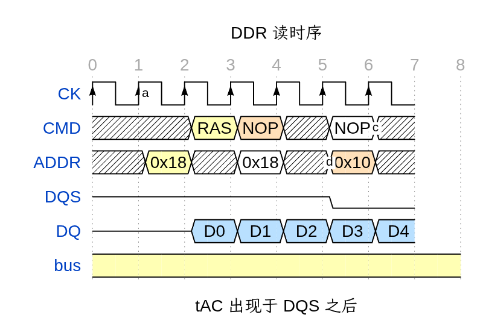

# WaveDrom-Gui VSCode 扩展示例

在 Markdown 预览中观察：

## 1. 代码块渲染（wavedrom 围栏）

预览会在此位置直接显示渲染出的波形。**默认不显示任何按钮**：在波形上**右键 →「编辑波形」**即进入可视化编辑器（编辑结果实时写回本代码块），默认的「严格」预览安全级别下也能直接用，不需要放宽安全设置。想让入口更显眼，把设置 `wavedrom-gui.previewEditAffordance` 改成 `button`（右上角铅笔按钮）或 `block`（点波形任意处即编辑）。

上面这行 ` ```wavedrom ` 的源码上方还有一行「编辑波形」CodeLens，点击同样进入编辑器；那是不经过预览的备用入口（设置 `wavedrom-gui.showCodeLens` 可关掉）。

```wavedrom
{ "signal": [
  { "name": "clk",  "wave": "p.........", "node": ".a........" },
  { "name": "req",  "wave": "0.1.....0.", "node": "..b......." },
  { "name": "data", "wave": "x.==..x...", "data": ["D0", "D1"] }
] }
```

## 2. 内嵌 WaveJSON 的图片

下面这张 PNG 的元数据里带着 WaveJSON（由 wavedrom-render skill 生成）——
预览会识别它，编辑入口与代码块一致（默认在波形上**右键 →「编辑波形」**；源码里这行引用上方同样有「编辑波形」CodeLens）。

图片的编辑面板位置用设置 `wavedrom-gui.editorPanelPosition` 控制：`current`（默认，与预览同栏、标签切换）/ `beside`（右侧新开一栏）/ `below`（预览在上、编辑在下）/ `newWindow`（独立窗口）。




## 3. 不会被打扰的普通内容

```json
{ "this": "普通 json 围栏不会被拦截" }
```
