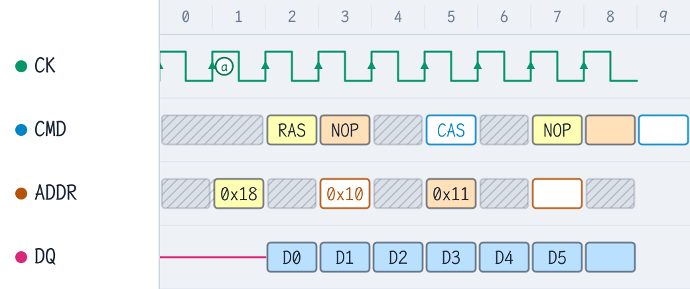

# WaveDrom-Gui VSCode 扩展示例

在 Markdown 预览中观察：

## 1. 代码块渲染（```wavedrom 围栏）

预览会在此位置直接显示渲染出的波形，上方工具栏可切换 **现代 / 传统** 主题、查看**源码**、点击 **✏ 编辑** 进入可视化编辑器（编辑结果实时写回本代码块）。

```wavedrom
{ "signal": [
  { "name": "clk",  "wave": "p.........", "node": ".a........" },
  { "name": "req",  "wave": "0.1.....0.", "node": "..b......." },
  { "name": "data", "wave": "x.==..x...", "data": ["D0", "D1"] }
] }
```

## 2. 内嵌 WaveJSON 的图片

下面这张 PNG 的元数据里带着 WaveJSON（由 wavedrom-render skill 导出）。
预览会识别它并出现同样的工具栏；**编辑保存只更新图片里的元数据，像素不变**。



## 3. 不会被打扰的普通内容

```json
{ "this": "普通 json 围栏不会被拦截" }
```


